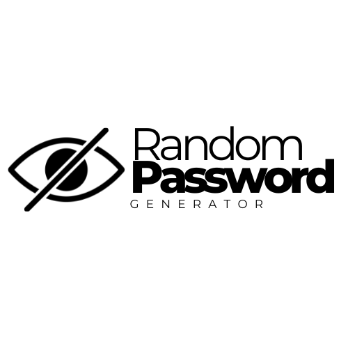

# Random Password Generator

*A web application that provides you secure passwords for your accounts.*

## Features

- **Password Generator**: Passwords at your convenience with just a push of a button.
- **Copy-to-Clipboard feature**: Password will be copied to your clipboard once you click the text for ease of use.

## Usage

1. Open the application 
2. Press the "Generate Passwords" button to produce passwords
3. Click your preffered password and paste it to your account or to your notes app for safe keeping

## Getting Started

### Prerequisites

- A modern web browser (Chrome, Firefox, Safari, Edge)

## Development

This project uses:
- HTML5 for structure
- CSS3 for styling
- JavaScript for functionality

## Acknowledgments
- Inspired by scrimba's password generator project
